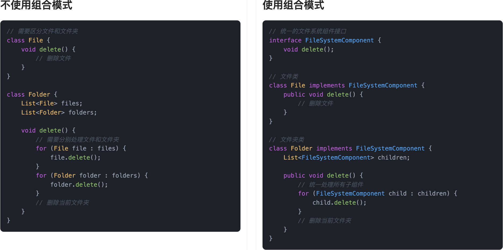
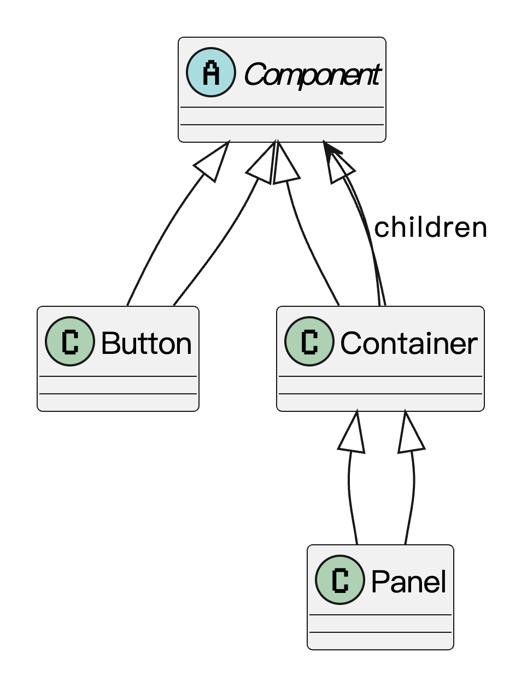

## 什么是组合模式？
**组合模式**（Composite Pattern）是一种结构型设计模式，它是一种让我们可以用统一的方式来处理**单个对象**和**一组对象**的设计思路。它的核心思想就是：无论是一个元素，还是一组元素，我都用同一套接口、一致的方式去操作，不用每次都写一堆 if 判断去区分“你到底是个体还是整体”。

在开发中，我们经常会碰到“部分-整体”的结构，比如文件系统：一个文件夹里可以放文件，也可以放文件夹，后者又可以继续嵌套文件……这时候如果每种情况都单独处理，会导致代码不够优雅。组合模式就让你像处理一个单独文件那样处理整个文件夹，递归也轻松搞定。

举个例子，我们都搬过家吧，需要整理一大堆打包好的箱子。每个箱子里可能直接装着物品，比如一本书、一只杯子，也可能是一个更小的箱子，里面再装别的东西。

最后你看着这些大箱子、小箱子，其实根本不用关心“它到底是单个物品，还是一堆东西的集合”，因为你对它们的处理方式是一样的——拿起来、贴个标签、装上车。这个过程中，你对“单件”和“组合”的操作方式是完全一致的。


通俗点说，它就是帮我们把“单个”和“多个”的操作方式统一起来，让代码更简洁、更优雅，扩展也方便。

## 为什么要使用组合模式？
系统开发中，随着功能的不断扩展，对象之间的关系往往变得复杂，有时候单个对象也能完成事情，有时候又需要一组对象配合才能完成。如果我们在代码里频繁去判断是单个对象还是一组对象，不仅逻辑繁琐，还容易出错。组合模式通过统一接口，把这两种情况统一起来，大大简化了客户端代码，让整体结构更加清晰，扩展起来也更加自然顺手。尤其是在涉及树形结构、递归处理的场景下，组合模式能帮我们优雅地管理这些复杂的对象关系。

为了让大家更好地感受到组合模式的作用，以文件系统管理为例，我们需要管理文件和文件夹的层级结构。让我们来看看使用和不使用组合模式的区别：



通过对比可以看出，不使用组合模式时，我们需要分别处理文件和文件夹两种不同的类型，这导致了代码的重复和复杂度的增加。每当需要添加新的操作时，都需要在文件和文件夹类中分别实现，而且客户端需要区分处理不同类型的节点。

而使用组合模式后，我们通过统一的接口将文件和文件夹抽象为相同的组件，使得客户端可以用一致的方式处理所有节点。这种设计不仅简化了代码结构，还提高了系统的可扩展性。当需要添加新的操作时，只需要在接口中定义并在各个实现类中实现即可，无需修改客户端代码。

## 组合模式的应用场景
举一些开发中典型的应用场景：

+ 文件系统管理：在一个文件管理系统中，文件和文件夹可以构成树形结构，文件夹可以包含多个文件或其他文件夹。组合模式可以将文件和文件夹抽象成统一的接口，使得在操作文件夹和文件时，可以使用相同的方法。比如，用户想删除一个文件夹，无论该文件夹中包含的是文件还是子文件夹，操作方式都是一样的。
+ 企业组织结构：在处理企业的组织结构时，可以将公司、部门、员工等抽象为组件。公司是一个组合对象，包含多个部门；部门可以包含多个员工。组合模式允许我们将公司、部门和员工看作一个统一的接口，方便在遍历和操作整个组织结构时使用相同的方式，无论操作的是公司、部门还是单个员工。
+ 菜单管理系统：在一个菜单管理系统中，菜单项可以是简单的单项（如一个按钮或链接）或者是复杂的菜单（如包含多个子菜单项的下拉菜单）。组合模式可以将菜单项和菜单容器统一处理，使得无论是普通菜单项还是包含子菜单的复合菜单，都能以相同的方式进行渲染、更新或删除。这样在实现菜单功能时，可以灵活地添加或修改菜单层级结构。

## 组合模式的基本结构
组合模式具有的角色和职责：

1）抽象组件（Component）：定义了所有组件（包括基本组件和容器组件）必须遵循的接口，比如公共的方法，比如添加、删除、获取子组件等。

2）叶子节点（Leaf）：代表最基本的、不能再分的对象，比如普通员工。叶子节点实现了抽象组件定义的接口，但不会再包含子节点。

3）容器节点（Composite）：代表可以包含子组件的对象，比如部门经理。容器节点同样实现了抽象组件接口，同时内部维护着子节点集合，并实现对子节点的添加、删除等操作。

下面用一张类图帮大家更直观地理解组合模式的结构：


## 组合模式的实现
下面就以 “文件系统管理” 为例，我们用组合模式实现一个简单的文件结构系统。

1）定义统一的文件组件接口：声明操作方法，比如显示信息

```java
public interface FileComponent {
    void display(String indent);
}
```
这一步定义了组合模式的“抽象组件”，统一所有文件系统节点的操作接口，比如 `display()` 方法用于展示目录结构。

2）实现叶子节点类：表示文件

```java
public class FileLeaf implements FileComponent {
    private String name;

    public FileLeaf(String name) {
        this.name = name;
    }

    public void display(String indent) {
        System.out.println(indent + "- 文件：" + name);
    }
}
```
`FileLeaf` 是叶子节点类，代表文件，不包含其他子节点，只负责输出自己的名字，是组合结构中最底层的节点。

3）实现组合节点类：表示文件夹

```java
import java.util.ArrayList;
import java.util.List;

public class FolderComposite implements FileComponent {
    private String name;
    private List<FileComponent> children = new ArrayList<>();

    public FolderComposite(String name) {
        this.name = name;
    }

    public void add(FileComponent component) {
        children.add(component);
    }

    public void remove(FileComponent component) {
        children.remove(component);
    }

    public void display(String indent) {
        System.out.println(indent + "+ 文件夹：" + name);
        for (FileComponent child : children) {
            child.display(indent + "  ");
        }
    }
}
```
`FolderComposite` 是组合节点，代表文件夹，可以包含任意数量的子文件或子文件夹，实现递归遍历并展示结构，是组合模式的核心。

4）客户端调用示例：构建并展示一个文件树结构

```java
public class FileSystemClient {
    public static void main(String[] args) {
        // 创建文件
        FileLeaf file1 = new FileLeaf("readme.txt");
        FileLeaf file2 = new FileLeaf("logo.png");
        FileLeaf file3 = new FileLeaf("data.csv");

        // 创建文件夹
        FolderComposite root = new FolderComposite("根目录");
        FolderComposite docs = new FolderComposite("文档");
        FolderComposite images = new FolderComposite("图片");

        // 构建层级关系
        docs.add(file1);
        images.add(file2);

        root.add(docs);
        root.add(images);
        root.add(file3);

        // 显示结构
        root.display("");
    }
}
```
输出结果：

```plain
+ 文件夹：根目录
  + 文件夹：文档
    - 文件：readme.txt
  + 文件夹：图片
    - 文件：logo.png
  - 文件：data.csv
```
客户端不需要关心节点到底是文件还是文件夹，只调用 `display()` 方法即可，组合模式让“整体”和“部分”拥有一致的操作方式，实现了对复杂结构的透明访问。

## 组合模式的优缺点
### 优点
+ **树形结构的表示**：组合模式能够将对象组织成树形结构，适用于表示“部分-整体”的层次结构，如文件系统、组织结构等。
+ **统一性**：客户端可以统一处理单个对象和对象集合，简化了代码的复杂性。在操作时无需区分复合对象与叶子节点，可以统一使用相同的接口进行操作。
+ **扩展性**：通过递归方式，容易为树形结构添加新的操作或新类型的对象，无需修改已有代码即可实现新功能。
+ **灵活性**：组合模式使得对象的组合和解组合更加灵活，组合结构可以按需变化。

### 缺点
+ **过度泛化**：组合模式可能会导致设计过于泛化，叶子节点和复合节点使用统一接口，可能会引起不必要的复杂性。如果不加区分，复合节点和叶子节点的功能可能会被过度简化，导致某些操作不符合实际需求。
+ **不适合复杂对象**：如果对象层次过于复杂，组合模式可能会导致大量的类和接口，增加系统的复杂性，降低维护性。
+ **难以控制部分操作**：当组合对象非常复杂时，处理某些特定的部分操作可能会变得困难，因为无法简单区分叶子节点和复合节点的行为。

## 扩展知识 - 源码分析
### 开源框架中的应用
#### 1、JDK
其在 JDK 中，`java.awt.Component` 体系就是组合模式的体现。

在 AWT 的 UI 组件系统中，`Component` 是所有组件的父类，而 `Container` 是一种特殊的 `Component`，它可以嵌套别的 `Component`。

```java
public abstract class Component implements ImageObserver, MenuContainer,
                                           Serializable{
    // 所有 UI 组件的基类
}

public class Button extends Component implements Accessible {
    // 叶子节点，没有子组件
}

public class Panel extends Container implements Accessible {
    // 树枝节点，可以容纳别的 Component
}

```
而 `Container` 是可以添加子组件的：

```java
public class Container extends Component {
    private List<Component> componentList = new ArrayList<>();

     public Component add(Component comp) {
        addImpl(comp, null, -1);
        return comp;
    }
}

```
这就形成了一个组合结构，`Component` 是统一接口，`Button` 是叶子节点，`Panel` 是组合节点，可以包含多个 `Component`。可以看下类图：



#### 2、Spring 框架
Spring Web MVC 中就大量使用了组合模式，其中几个非常典型的类包括：

+ `HandlerMethodArgumentResolverComposite`
+ `HandlerMethodReturnValueHandlerComposite`
+ `HandlerExceptionResolverComposite`
+ `ViewResolverComposite`

我们以 `HandlerMethodArgumentResolverComposite` 为例来分析，这个类是 Spring MVC 在方法参数解析时用的组合容器。

先看下这个类的部分源码结构：

```java
public class HandlerMethodArgumentResolverComposite implements HandlerMethodArgumentResolver {
    // 用于存储注册的参数解析器列表
    private final List<HandlerMethodArgumentResolver> argumentResolvers = new ArrayList<>();

    // 用于缓存已经解析过的参数对应的解析器，提高性能（此处未显示定义，实际源码中为 Map 缓存）
    private final Map<MethodParameter, HandlerMethodArgumentResolver> argumentResolverCache =
    new ConcurrentHashMap<>(256);

    //添加一个参数解析器到组合中
    public HandlerMethodArgumentResolverComposite addResolver(HandlerMethodArgumentResolver resolver) {
        this.argumentResolvers.add(resolver);
        return this;
    }

    // 判断是否支持解析某个方法参数
    @Override
    public boolean supportsParameter(MethodParameter parameter) {
        return getArgumentResolver(parameter) != null;
    }

    // 根据参数查找支持该参数的解析器，并使用缓存提升性能
    @Nullable
    private HandlerMethodArgumentResolver getArgumentResolver(MethodParameter parameter) {
        HandlerMethodArgumentResolver result = this.argumentResolverCache.get(parameter);
        if (result == null) {
            for (HandlerMethodArgumentResolver resolver : this.argumentResolvers) {
                if (resolver.supportsParameter(parameter)) {
                    result = resolver;
                    this.argumentResolverCache.put(parameter, result);
                    break;
                }
            }
        }
        return result;
    }
    // 调用支持该参数的解析器进行参数解析
    public Object resolveArgument(MethodParameter parameter, @Nullable ModelAndViewContainer mavContainer,
                                  NativeWebRequest webRequest, @Nullable WebDataBinderFactory binderFactory) throws Exception {

        HandlerMethodArgumentResolver resolver = getArgumentResolver(parameter);
        if (resolver == null) {
            throw new IllegalArgumentException("Unsupported parameter type [" +
                                               parameter.getParameterType().getName() + "]. supportsParameter should be called first.");
        }
        return resolver.resolveArgument(parameter, mavContainer, webRequest, binderFactory);
    }
}

```
可以看到，它本身实现了 `HandlerMethodArgumentResolver` 接口，但它内部是组合了一堆 `HandlerMethodArgumentResolver` 实例。

也就是说，从客户端的角度来看，无论是使用一个解析器，还是一组解析器，使用方式完全一样。这就是组合模式的精髓。

其他类似的组合器还有：

1）`HandlerMethodReturnValueHandlerComposite`  
2）`HandlerExceptionResolverComposite`  
3）`ViewResolverComposite`

这些类的结构和思路都很接近，都是：自己实现接口，内部持有多个实现实例，统一代理转发调用。

### 优势和作用
通过上述的源码分析，我们可以再次总结下组合模式的作用。

#### 1、统一处理逻辑，简化调用
组合模式可以让我们对“一个对象”还是“一组对象”进行统一处理，省去了调用方的条件判断和分支逻辑。比如参数解析器，我们不需要管到底是哪个解析器支持，组合器会统一负责找合适的。

#### 2、扩展性强，插件式开发友好
每个子解析器（HandlerMethodArgumentResolver 实现类）都可以独立实现，互不干扰，添加新的处理器只需要注册到组合器中，不用改原有逻辑。

#### 3、层级嵌套灵活，天然适合处理树形结构
像菜单、目录、组件树等天然结构，都适合用组合模式建模，结构清晰、功能解耦，容易维护。

## 相关面试题
可以在 [程序员面试刷题神器 - 面试鸭](https://www.mianshiya.com/) 上获取到企业常问的设计模式面试题。比如：

1）[什么是组合模式？一般用在什么场景？ ](https://www.mianshiya.com/bank/1801559627969929217/question/1802557097684312065)


