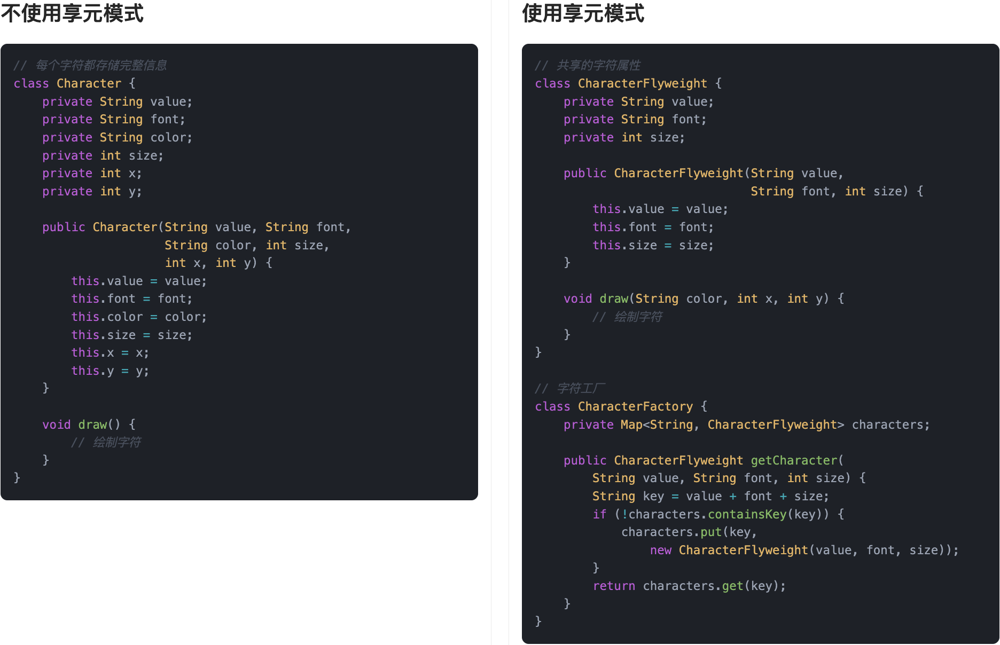
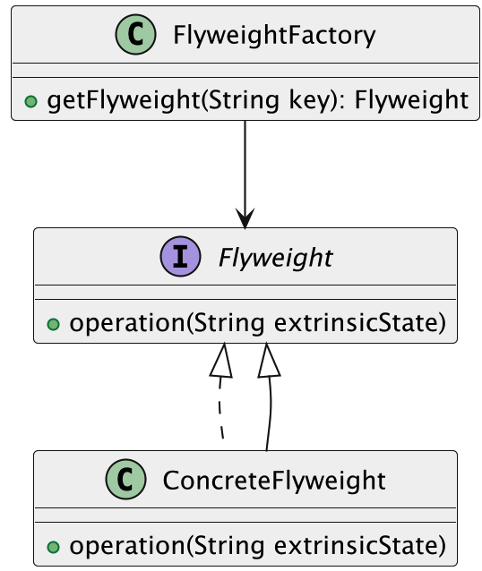
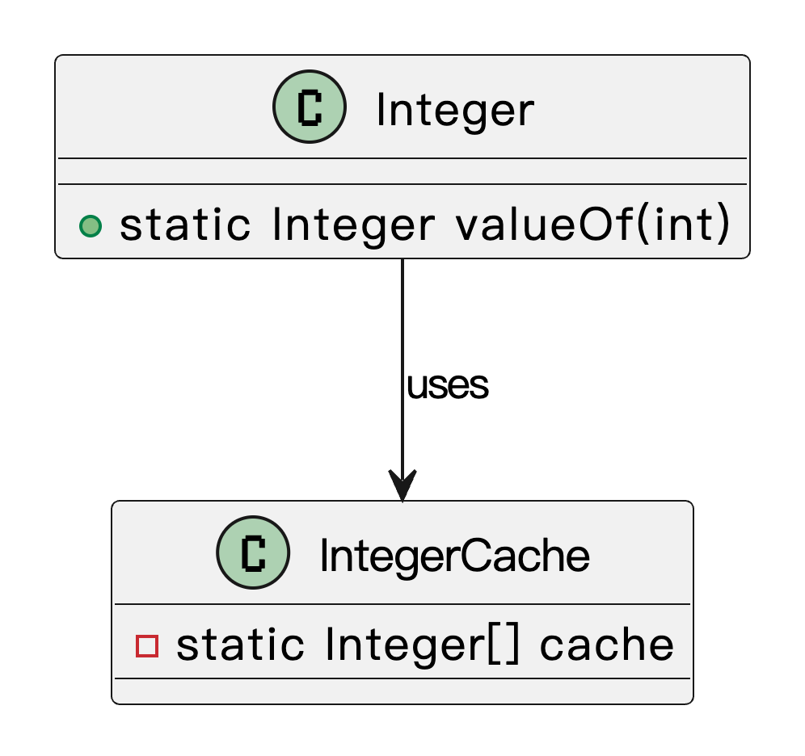

## 什么是享元模式？
**享元模式**（Flyweight Pattern）是一种结构型设计模式，它的核心思想是：**通过共享对象，减少系统中对象的数量，从而节省内存，提高性能**。在很多应用场景中，我们经常会遇到需要大量创建相似对象的情况，而这些对象之间其实有很多内容是可以共享的。享元模式就是专门针对这种情况提出的：把可以共享的部分提取出来，放到一个公共对象里，只保留那些不可共享的部分，减少重复创建，从而节省资源开销。

我们之前在学校上课的时候，每个人都会发一本教科书。想一想，其实每个人的课本内容是一样的，只是使用者不同。如果每个人都印一本新的，那资源就浪费了。我们完全可以共用一本电子教材，每个人阅读的时候，传进去自己的用户信息，这样既节省了纸张，也节省了印刷成本。 这就和享元模式非常类似：共用相同的部分，把变化的部分单独管理。


所以，享元模式适合用于那种“重复多、变化少”的场景，帮我们有效减少内存开销，提升系统性能。

## 为什么要使用享元模式？
在系统开发中，有些对象的数量非常庞大，比如地图上的每一棵树、游戏中每一颗子弹、文档编辑器里的每一个字符。如果为每个元素都创建独立的对象，内存开销是巨大的，系统的响应速度也会下降。使用享元模式，我们可以把那些相同的数据抽取出来，做成可以共享的对象，多个使用场景共用同一份数据，只针对变化的部分做单独处理。这样既节省了内存，又能提高系统的整体性能。

为了让大家更好地感受到享元模式的作用，以字符缓存系统为例，我们需要高效地渲染大量重复的字符。让我们来看看使用和不使用享元模式的区别：



通过对比可以看出，不使用享元模式时，每个字符都需要创建一个完整的对象实例，即使这些字符具有相同的符号和字体。这种方式会导致大量重复对象的创建，造成内存浪费，特别是在需要渲染大量重复字符的场景下。

而使用享元模式后，我们将字符的固有属性（符号和字体）作为内部状态，将变化的位置和颜色作为外部状态。通过享元工厂管理共享的字符对象，大大减少了内存占用。这种设计不仅提高了系统的性能，还使得代码结构更加清晰。当需要添加新的字符类型时，只需要在工厂中添加相应的创建逻辑即可，无需修改现有代码。

## 享元模式的应用场景
举一些开发中典型的应用场景：

+ 文本编辑器中的字符缓存：在文本编辑器中，可能会有大量相同的字符（如重复出现的字母、符号等）。而每个字符的显示样式（如字体、颜色、大小）可能是相同的。通过享元模式，可以将共享的字符属性（如字形、字体）提取出来作为享元对象，只保存那些需要变化的属性（如位置、颜色），减少重复存储，提高系统效率。
+ 网页中的图标缓存：在一个网页应用中，可能需要显示大量图标，很多图标是重复使用的（比如社交媒体图标、按钮图标等）。通过享元模式，可以将这些共享图标的显示细节（如图形、颜色、大小等）抽象为享元对象，而将特定位置、状态等动态变化的部分保存在其他地方，从而节省内存，提高响应速度。

## 享元模式的基本结构
享元模式具有的角色和职责：

1）抽象享元（Flyweight）：定义享元对象的接口，规定外部状态传入的标准方法。

2）具体享元（ConcreteFlyweight）：实现抽象享元接口，内部保存可以共享的状态。

3）享元工厂（FlyweightFactory）：负责创建和管理享元对象，确保相同的享元对象只被创建一次，并进行共享。

4）客户端（Client）：通过享元工厂获取享元对象，同时传入外部状态进行使用。

下面用一张类图帮大家更直观地理解享元模式的结构：



## 享元模式的实现
下面就以 “字符缓存系统” 为例，我们用享元模式实现一个高效的字符渲染机制。

1）定义享元接口：声明共享对象的标准方法

```java
public interface Glyph {
    void render(int x, int y, String color);
}
```
这一步的目的是定义所有可共享字符的统一操作接口，比如字符的 `render()` 渲染方法，让我们可以统一管理各种字符。

2）实现具体享元类：封装可以被共享的内部状态

```java
public class CharacterGlyph implements Glyph {
    private final char symbol; // 内部状态，不随使用变化
    private final String font; // 内部状态：字体

    public CharacterGlyph(char symbol, String font) {
        this.symbol = symbol;
        this.font = font;
    }

    @Override
    public void render(int x, int y, String color) {
        System.out.println("渲染字符 '" + symbol + "'，字体：" + font + "，颜色：" + color + "，位置：(" + x + "," + y + ")");
    }
}
```
这一步是享元模式的核心——把所有字符都“标准化”，只保留不变的信息，比如字符本身和字体，这些可以被多个对象共享。

3）创建享元工厂：用于管理和复用享元对象

```java
import java.util.HashMap;
import java.util.Map;

public class GlyphFactory {
    private Map<String, Glyph> glyphPool = new HashMap<>();

    public Glyph getGlyph(char symbol, String font) {
        String key = symbol + ":" + font;
        if (!glyphPool.containsKey(key)) {
            glyphPool.put(key, new CharacterGlyph(symbol, font));
        }
        return glyphPool.get(key);
    }
}
```
这一步提供了享元对象的集中管理。无论创建多少次相同的字符，只要字体一样，就只会创建一个共享实例。

4）定义包含外部状态的字符视图类：包括位置、颜色等变化信息

```java
public class CharacterView {
    private final Glyph glyph;
    private final int x;
    private final int y;
    private final String color;

    public CharacterView(Glyph glyph, int x, int y, String color) {
        this.glyph = glyph;
        this.x = x;
        this.y = y;
        this.color = color;
    }

    public void draw() {
        glyph.render(x, y, color);
    }
}
```
这一步把“变化的外部状态”提取出来，像位置、颜色都不参与共享，这样不同位置的字符可以使用同一个 Glyph 对象。

5）客户端调用示例

```java
public class Client {
    public static void main(String[] args) {
        GlyphFactory factory = new GlyphFactory();

        CharacterView[] page = new CharacterView[] {
            new CharacterView(factory.getGlyph('a', "Arial"), 10, 10, "black"),
            new CharacterView(factory.getGlyph('b', "Arial"), 20, 10, "black"),
            new CharacterView(factory.getGlyph('a', "Arial"), 30, 10, "red"),
            new CharacterView(factory.getGlyph('a', "Arial"), 40, 10, "blue"),
            new CharacterView(factory.getGlyph('b', "Arial"), 50, 10, "black"),
        };

        for (CharacterView cv : page) {
            cv.draw();
        }
    }
}
```
输出结果：

```plain
渲染字符 'a'，字体：Arial，颜色：black，位置：(10,10)
渲染字符 'b'，字体：Arial，颜色：black，位置：(20,10)
渲染字符 'a'，字体：Arial，颜色：red，位置：(30,10)
渲染字符 'a'，字体：Arial，颜色：blue，位置：(40,10)
渲染字符 'b'，字体：Arial，颜色：black，位置：(50,10)
```
通过这种方式，多个相同字符共享了同一个 `CharacterGlyph` 实例，只在需要时添加变化的位置信息，大大减少内存开销。

## 享元模式的优缺点
### 优点
+ **节省内存**：享元模式通过共享对象来减少内存的使用。当多个对象拥有相同的状态时，可以通过共享这些对象来避免重复创建，尤其在需要大量相似对象时，节省了大量内存。
+ **提高性能**：通过对象的共享，减少了对象的创建和销毁，尤其是在大量对象需要频繁创建的场景中，能够显著提高系统性能，减少系统开销。
+ **支持大规模对象管理**：享元模式特别适用于需要管理大量对象的场景，如图形编辑、文字排版等。它能够通过共享内存，提高对象的使用效率，适应大规模的对象管理需求。

### 缺点
+ **增加了复杂性**：享元模式需要管理享元池（对象池）和分离内外部状态，设计和实现上可能比直接创建对象要复杂。需要仔细处理对象共享和状态管理，避免引入不必要的复杂性。
+ **对象状态管理困难**：享元模式的共享对象往往是不可变的。若对象的状态是可变的，需要将内部状态和外部状态分开管理，这可能会增加代码的复杂度和维护难度。
+ **可能导致资源竞争**：当多个对象共享同一个实例时，如果共享的对象没有正确同步，可能会导致资源竞争或线程安全问题，尤其在多线程环境下，必须格外小心。

## 扩展知识 - 源码分析
### 开源框架中的应用
#### 1、JDK
在 JDK 中，最典型的享元模式实现就是 `Integer.valueOf()` 方法。

这个方法在返回 `Integer` 对象的时候，并不会每次都 new 一个，而是对 -128 到 127 范围内的整数做了缓存，直接复用已经存在的对象。源码在 `Integer` 类中有非常清晰的体现：

```java
public final class Integer extends Number implements Comparable<Integer> {
    /**
     * IntegerCache 是 Integer 类的静态内部类，用于缓存一部分 Integer 对象。
     * Java 为了节省内存并提高性能，会缓存一部分频繁使用的 int 值（默认是 -128 到 127）。
     */
    private static class IntegerCache {
        // 缓存下界，固定为 -128
        static final int low = -128;
        // 缓存上界，默认是 127，可以通过 JVM 参数调整
        static final int high;
        // 用于存放缓存的 Integer 实例数组
        static final Integer cache[];

        static {
            // high value may be configured by property
            int h = 127;
            String integerCacheHighPropValue =
            sun.misc.VM.getSavedProperty("java.lang.Integer.IntegerCache.high");
            if (integerCacheHighPropValue != null) {
                try {
                    int i = parseInt(integerCacheHighPropValue);
                    i = Math.max(i, 127);
                    // Maximum array size is Integer.MAX_VALUE
                    h = Math.min(i, Integer.MAX_VALUE - (-low) -1);
                } catch( NumberFormatException nfe) {
                    // If the property cannot be parsed into an int, ignore it.
                }
            }
            high = h;

            cache = new Integer[(high - low) + 1];
            int j = low;
            for(int k = 0; k < cache.length; k++)
            cache[k] = new Integer(j++);

            // range [-128, 127] must be interned (JLS7 5.1.7)
            assert IntegerCache.high >= 127;
        }

        private IntegerCache() {}
    }
    /**
     * valueOf 方法是 Integer 类的工厂方法，用于获取一个 Integer 对象。
     * 对于常用的小整数（-128 到 127），会直接从缓存中取，避免重复创建对象。
     */
    public static Integer valueOf(int i) {
        // 如果 i 在缓存范围内，直接返回缓存对象
        if (i >= IntegerCache.low && i <= IntegerCache.high)
            return IntegerCache.cache[i + (-IntegerCache.low)];
        // 超出缓存范围，创建新的 Integer 对象
        return new Integer(i);
    }
}

```
可以看到，`Integer.valueOf()` 本质就是一个享元工厂，它根据输入决定是否从缓存返回，最大程度地减少对象创建的成本。

我们用类图来简单表示下结构：



### 优势和作用
通过上述的源码分析，我们可以再次总结下享元模式的作用。

#### 1、节省内存，提高性能
享元模式最直接的好处是**避免重复创建相同对象**，比如 Integer 缓存了 [-128,127] 的对象，很多场景下都能避免频繁的 GC。

#### 2、统一管理共享对象，逻辑更清晰
享元工厂作为统一的入口，不但能集中管理复用对象，还能方便我们进行调试和监控，比如监控缓存命中率、缓存数量等。

## 相关面试题
可以在 [程序员面试刷题神器 - 面试鸭](https://www.mianshiya.com/) 上获取到企业常问的设计模式面试题。比如：

1）[什么是享元模式？一般用在什么场景？ ](https://www.mianshiya.com/bank/1801559627969929217/question/1802557572714405889)


