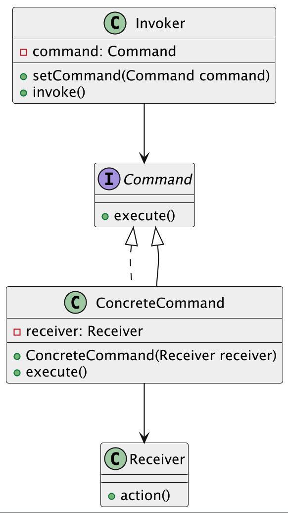

## 什么是命令模式？
**命令模式**（Command Pattern）是一种行为型设计模式。它的核心思想是：**把请求封装成一个对象**，这样我们就能用不同的请求、队列或者日志来参数化其他对象，同时也支持可撤销操作。

简单来说，就是把“干什么”和“怎么干”分开了。发送请求的人只需要负责提出需求，不需要关心具体怎么执行。而执行的人，拿到命令对象，就知道要做什么了。

举个生活里的例子，比如鱼皮我在忙着写教程的时候，会让同事安排点事：“明天早上帮我订张去北京的高铁票”、“今天下班前把这个代码提交了”，这些请求就像是一条条命令，而同事负责的就是把命令照着执行。这期间我不用操心执行细节，同事也不用搞清楚为什么要这么做，只要任务写清楚，拿到命令就能干活。而且我还可以随时更改任务，比如取消订票、把提交代码的时间提前，也就是“撤销命令”或“重新安排命令”。这不就是命令模式的真实写照吗？


程序里也一样，比如我们要实现一个“操作队列”，或者需要“支持撤销功能”的按钮系统（比如文档软件里的 Ctrl + Z），命令模式就特别好用。你可以把每一次操作封装成一个命令对象，然后放到队列里去统一处理，什么时候执行、执行几次、要不要撤销，都能灵活控制。

## 为什么要使用命令模式？
在开发过程中，常常会遇到这样的需求：我们需要把请求的发送者和请求的执行者隔离开来，让两者之间不直接依赖。这种场景下，如果直接在发送者中硬编码调用执行逻辑，系统就会变得很僵硬，未来一旦执行逻辑要变化，发送者的代码也不得不改动。

命令模式通过把操作封装成对象，让请求发送者只负责发出命令，不需要知道命令具体是怎么执行的。这样不仅降低了耦合度，还能轻松做到记录日志、排队执行、撤销操作等功能。整体上，命令模式让系统更加灵活、可扩展、好维护。

为了让大家更好地感受到命令模式的作用，以任务调度系统为例，我们需要实现一个灵活的任务执行平台，支持多种类型的任务调度。让我们来看看使用和不使用命令模式的区别：


通过对比可以看出，不使用命令模式时，任务调度器需要直接处理所有类型的任务，使用 if 语句进行判断。这种方式导致代码耦合度高且维护困难，每当需要添加新的任务类型时，都需要修改`Scheduler`类的代码，违反了开闭原则。

而使用命令模式后，我们将每个任务封装成独立的命令对象，通过Task接口统一管理。`TaskScheduler`类不再关心具体的任务执行逻辑，只需要调用命令对象的 execute 方法即可。这种设计使得系统更加灵活，添加新的任务类型只需要创建新的命令类，无需修改现有代码。同时，命令模式也使得代码结构更加清晰，每个命令类都专注于自己的职责，提高了代码的可维护性。

## 命令模式的应用场景
举一些开发中典型的应用场景：

+ 任务调度系统中的任务封装：在定时任务或调度平台中，不同的任务操作（如发送邮件、生成报表、备份数据）可以被封装成命令对象，通过命令模式统一调度、管理和执行任务，支持任务队列、日志记录、失败重试等功能。
+ 界面操作的撤销与重做功能：在图形编辑器、表格编辑器或代码编辑器中，用户的每一次操作（如插入、删除、修改）都可以被封装成命令对象，支持执行、撤销和重做等操作。命令模式可以帮助记录用户操作历史，实现操作回滚功能。
+ 消息中间件中的指令执行模型：在基于MQ的系统中，不同类型的消息可以对应不同的业务指令，如订单处理、用户注册、支付完成等。通过命令模式，每种消息对应一个命令对象，消息消费者执行接收到的命令对象，从而实现解耦和扩展。

## 命令模式的基本结构
命令模式具有的角色和职责：

1）命令接口（Command）：声明执行操作的方法，比如`execute()`。

2）具体命令（ConcreteCommand）：实现命令接口，负责调用接收者（Receiver）去完成请求。

3）接收者（Receiver）：真正执行具体业务逻辑的人（类）。

4）请求者（Invoker）：负责调用命令对象来执行请求。

5）客户端（Client）：创建具体命令对象并设置好接收者，最后把命令交给请求者执行。

下面用一张类图帮大家更直观地理解命令模式的结构：



## 命令模式的实现
下面就以“任务调度系统”为例，我们用命令模式来构建一个可扩展的任务执行平台。

1）定义命令接口：所有任务的统一接口

```java
public interface Task {
    void execute();
}
```
命令接口 `Task` 代表所有可执行的调度任务，比如发邮件、备份、报表等，调用方式统一。

2）定义具体任务类：实现不同的业务操作

```java
public class EmailTask implements Task {
    @Override
    public void execute() {
        System.out.println("发送通知邮件...");
        // 实际的发邮件逻辑
    }
}
```
```java
public class BackupTask implements Task {
    @Override
    public void execute() {
        System.out.println("正在备份数据库...");
        // 实际的备份逻辑
    }
}
```
```java
public class ReportTask implements Task {
    @Override
    public void execute() {
        System.out.println("生成业务报表...");
        // 实际的报表生成逻辑
    }
}
```
每个任务类代表一个可执行的命令对象，内部封装具体的业务逻辑，便于独立管理和扩展。

3）定义任务调度器：统一调度任务队列并执行

```java
import java.util.LinkedList;
import java.util.Queue;

public class TaskScheduler {
    private Queue<Task> taskQueue = new LinkedList<>();

    public void addTask(Task task) {
        taskQueue.offer(task);
    }

    public void run() {
        while (!taskQueue.isEmpty()) {
            Task task = taskQueue.poll();
            try {
                task.execute();
                System.out.println("任务执行成功！");
            } catch (Exception e) {
                System.out.println("任务执行失败，记录日志以供重试...");
            }
        }
    }
}
```
调度器负责统一管理所有任务对象，可以实现任务队列、任务执行、异常捕获等一整套执行流程。

4）客户端调用示例

```java
public class SchedulerClient {
    public static void main(String[] args) {
        TaskScheduler scheduler = new TaskScheduler();

        scheduler.addTask(new EmailTask());
        scheduler.addTask(new BackupTask());
        scheduler.addTask(new ReportTask());

        scheduler.run();
    }
}
```
输出结果：

```plain
发送通知邮件...
任务执行成功！
正在备份数据库...
任务执行成功！
生成业务报表...
任务执行成功！
```
命令模式的核心价值就在这里：我们将“做什么任务”抽象成一个命令对象，统一交由调度器来“何时执行”和“如何调度”，两者完全解耦。增加一个新任务，只需新建一个 `Task` 实现类，无需改动调度器。

## 命令模式的优缺点
### 优点
+ **解耦请求者和执行者**：命令模式通过将请求和执行操作分离，避免了请求者直接调用具体的执行者。这样，调用者无需知道具体的实现，只需要发出命令即可，从而减少了对象之间的依赖和耦合。
+ **支持撤销/恢复操作**：命令模式能够方便地实现操作的撤销和恢复。通过保存命令对象和其执行状态，可以在需要时撤销已执行的命令或恢复到之前的状态。
+ **增加新的命令很方便**：只需要创建新的命令类并实现相应的执行逻辑，就可以方便地增加新的命令，不需要修改现有的代码，符合开闭原则。
+ **支持宏命令**：命令模式可以通过将多个命令组合成一个宏命令来实现批量操作，方便了复杂操作的组织和管理。

### 缺点
+ **类的数量增加**：每个命令都需要一个对应的命令类，这会导致系统中的类数量增加，代码可能变得比较冗长，管理和维护成本上升。
+ **命令的管理和维护**：如果命令过多，可能会导致命令类和命令的管理变得复杂，尤其是对于需要撤销和恢复的命令，状态的维护可能会带来额外的复杂度。
+ **不适合简单的场景**：如果系统的操作非常简单且没有复杂的撤销/恢复需求，使用命令模式可能会显得过于复杂，反而增加了不必要的开销。

## 扩展知识 - 源码分析
### 开源框架中的应用
#### 1、JDK
在 JDK 里，命令模式最典型的应用就是线程池里的 `Runnable` 和 `Executor`。

我们可以这样理解：

+ `Runnable` 相当于一个“命令对象”，里面封装了具体要执行的业务逻辑。
+ `Executor` 是一个“命令的调用者”，负责接收并触发这些命令。

```java
// 命令接口，相当于 Command
@FunctionalInterface
public interface Runnable {
    public abstract void run();
}

// 命令接收者，可以执行命令
public class Thread {
    public Thread(Runnable target) {
        init(null, target, "Thread-" + nextThreadNum(), 0);
    }

    @Override
    public void run() {
        if (target != null) {
            target.run();
        }
    }
}

// 命令调用者，相当于 Invoker
public interface Executor {
    void execute(Runnable command);
}

```
在我们使用线程池时，会这么写：

```java
Executor executor = Executors.newFixedThreadPool(2);
executor.execute(() -> {
    System.out.println("处理一段业务逻辑");
});

```
这就是命令模式的使用场景：我们把具体要做的事封装成一个 `Runnable`，然后丢给 `Executor` 来执行。

### 优势和作用
通过上述的源码分析，我们可以再次总结下命令模式的作用。

#### 1、统一执行入口，提高解耦性
命令模式的一个核心优势是：它把“做什么”和“怎么执行”给分开了。比如在线程池里，提交任务的人只需要实现 `Runnable`，不需要关心线程调度的细节；而线程池只管调度和执行任务，也不需要知道具体业务逻辑。这种分工，特别适合解耦复杂系统中的职责划分。

#### 2、灵活支持命令队列、撤销、重做等机制
命令模式天然支持“记录每一个命令”，所以特别适合命令队列、操作日志、宏命令等需求。在一些流程编排系统或任务调度框架中，这种模式也很常见。

## 相关项目
#### 编程导航的代码生成器平台项目
在 [编程导航的代码生成器平台项目](https://www.codefather.cn/course/1790980795074654209) 在项目中，我们遵循了 Picocli 框架的规范设计，将每个子命令封装为独立的命令类。例如，`GenerateCommand` 用于执行代码生成操作，`ListCommand` 用于列出模板文件，`ConfigCommand` 用于查看代码生成配置。各个命令类职责单一、彼此独立，便于后续的功能扩展和维护。

在命令执行器类中，我们集中管理所有命令的注册和调用逻辑。通过 Picocli 提供的 API，将上述子命令统一绑定到主命令中。框架会根据用户在终端输入的命令自动完成解析，并分发执行相应的子命令，实现了清晰、灵活、可扩展的命令行交互体验。


## 相关面试题
可以在 [程序员面试刷题神器 - 面试鸭](https://www.mianshiya.com/) 上获取到企业常问的设计模式面试题。比如：

1）[什么是命令模式？一般用在什么场景？ ](https://www.mianshiya.com/bank/1801559627969929217/question/1802939265333927937)


