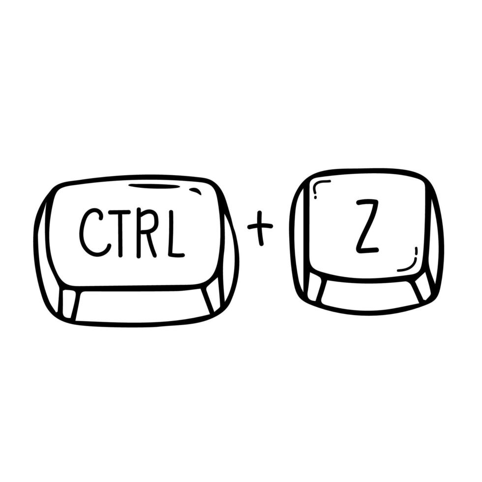
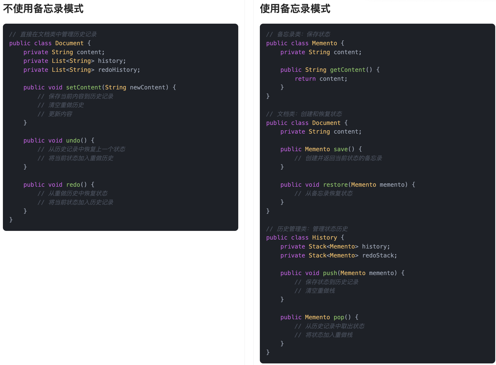
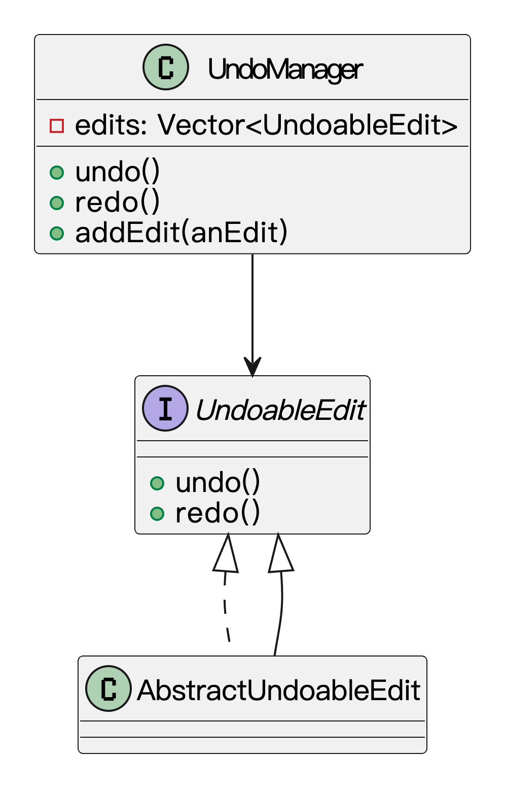

## 什么是备忘录模式？
**备忘录模式**（Memento Pattern）是一种行为型设计模式。它的核心思想是：**在不破坏对象封装性的前提下，捕获一个对象的内部状态，并在将来需要的时候能够恢复这个状态**。

有时候，我们在程序里需要让某个对象可以回到之前的某个历史状态，比如：文档的撤销功能、游戏的存档回档等等。如果不设计得好，我们很可能会暴露对象的内部细节，导致数据不安全，或者让对象之间的关系变得混乱。

为了实现这个功能，我们通常会额外搞一个“备忘录对象”出来，专门负责记录某个对象的状态。原始对象负责业务逻辑，备忘录只管记录快照，两者分工明确、互不打扰。这样既保留了封装性，又能灵活支持“状态恢复”，安全性和扩展性也都兼顾了。

鱼皮我平时写教程的时候，写着写着发现哪里写错字了，一个 Ctrl+Z，轻松回退。看起来好像只是一个撤销操作，实际上 Word 在你背后早就默默记录了多个状态快照，一旦出错就能“跳回过去”。这就是标准的备忘录模式的应用。



简单来说，它的作用就是让程序中的某个对象拥有“后悔药”功能，可以在关键时刻撤销回滚，让系统更健壮、更贴近真实需求。

## 为什么要使用备忘录模式？
在我们开发过程中，经常会遇到需要“恢复历史状态”的场景。如果每次都让对象自己暴露内部属性，自己去记录变化，不仅会破坏封装性，还容易导致逻辑混乱。  
使用备忘录模式后，对象可以把自己当前的状态保存到一个独立的备忘录对象里，既能保证对象的封装性，又能让我们在需要的时候，简单、安全地恢复到之前的状态。整体上，让程序在复杂状态变化中也能保持清晰、可控。

为了让大家更好地感受到备忘录模式的作用，以文档编辑器为例，我们需要实现一个支持撤销/重做功能的文本编辑器。让我们来看看使用和不使用备忘录模式的区别：



通过对比可以看出，不使用备忘录模式时，文档类需要直接管理历史记录，将状态信息与业务逻辑混合在一起。这种方式导致代码职责不清晰，且难以扩展新的功能，比如添加新的状态属性或支持不同类型的状态保存。

而使用备忘录模式后，我们将状态信息封装在独立的备忘录类中，通过历史管理类统一管理状态的保存和恢复。这种设计使得系统更加灵活，文档类只需要关注内容的编辑，不需要关心状态的管理。同时，备忘录模式也使得代码结构更加清晰，各个类的职责明确，提高了代码的可维护性和可扩展性。

## 备忘录模式的应用场景
举一些开发中典型的应用场景：

+ 文档编辑器的撤销/重做功能：在富文本编辑器、代码编辑器或在线文档中，用户每次编辑都会生成一个快照状态（如当前内容、光标位置等）。通过备忘录模式，可以保存多个状态记录，实现撤销和重做操作，让用户回退到之前的版本。
+ 游戏存档功能：在单机游戏或小游戏中，玩家可以保存当前游戏进度并在之后加载回这一状态。备忘录模式可以将玩家的游戏状态（如位置、血量、道具等）封装成一个备忘录对象，支持随时保存和恢复。
+ 图形绘图软件的操作记录：在画图类软件中，每次绘制图形、移动、撤销、重绘都可以保存当前画布状态。通过备忘录模式保存每次操作前后的状态，支持用户操作回滚，增强使用体验。

## 备忘录模式的基本结构
备忘录模式具有的角色和职责：

1）发起人（Originator）：需要保存状态的对象，负责创建和恢复备忘录。

2）备忘录（Memento）：存储发起人的内部状态，是一个纯数据对象。

3）管理者（Caretaker）：负责保存备忘录对象，但不直接操作备忘录的内容。

下面用一张类图帮大家更直观地理解备忘录模式的结构：


## 备忘录模式的实现
下面就以 “文档编辑器撤销/重做” 功能为例，我们用 备忘录模式 实现一个简单的文本编辑器。

1）定义备忘录类：用于存储文档的当前状态

```java
public class DocumentMemento {
    private String content;

    public DocumentMemento(String content) {
        this.content = content;
    }

    public String getContent() {
        return content;
    }
}
```
备忘录类（`DocumentMemento`）保存了文档的内容，它只提供读取的功能，不允许外部修改，确保了封装性。

2）定义文档类：负责修改和恢复文档状态

```java
public class Document {
    private String content;

    public Document(String content) {
        this.content = content;
    }

    public void setContent(String content) {
        this.content = content;
    }

    public String getContent() {
        return content;
    }

    public DocumentMemento save() {
        return new DocumentMemento(this.content);
    }

    public void restore(DocumentMemento memento) {
        this.content = memento.getContent();
    }
}
```
文档类（`Document`）拥有 `save` 和 `restore` 方法，用来创建和恢复文档的状态。每次编辑文档后，可以保存当前状态，若需要撤销，则通过 `restore` 方法恢复到之前的状态。

3）定义历史管理类：负责保存多个状态，用于撤销和重做

```java
import java.util.Stack;

public class History {
    private Stack<DocumentMemento> history = new Stack<>();
    private Stack<DocumentMemento> redoStack = new Stack<>();

    public void pushMemento(DocumentMemento memento) {
        history.push(memento);
        redoStack.clear(); // 每次新操作时清空重做栈
    }

    public DocumentMemento popMemento() {
        if (!history.isEmpty()) {
            DocumentMemento memento = history.pop();
            redoStack.push(memento);
            return memento;
        }
        return null;
    }

    public DocumentMemento popRedoMemento() {
        if (!redoStack.isEmpty()) {
            DocumentMemento memento = redoStack.pop();
            history.push(memento);
            return memento;
        }
        return null;
    }
}
```
`History` 类负责管理所有文档的历史状态。它保存了撤销操作和重做操作的栈，并通过 `pushMemento` 和 `popMemento` 方法来管理文档的历史记录。

4）客户端调用示例

```java
public class Client {
    public static void main(String[] args) {
        Document document = new Document("初始内容");
        History history = new History();

        // 保存初始状态
        history.pushMemento(document.save());
        System.out.println("文档内容: " + document.getContent());

        // 修改文档内容
        document.setContent("第一次编辑");
        history.pushMemento(document.save());
        System.out.println("文档内容: " + document.getContent());

        // 修改文档内容
        document.setContent("第二次编辑");
        history.pushMemento(document.save());
        System.out.println("文档内容: " + document.getContent());

        // 撤销
        document.restore(history.popMemento());
        System.out.println("撤销后文档内容: " + document.getContent());

        // 再次撤销
        document.restore(history.popMemento());
        System.out.println("再次撤销后文档内容: " + document.getContent());

        // 重做
        document.restore(history.popRedoMemento());
        System.out.println("重做后文档内容: " + document.getContent());
    }
}
```
输出结果：

```plain
文档内容: 初始内容
文档内容: 第一次编辑
文档内容: 第二次编辑
撤销后文档内容: 第一次编辑
再次撤销后文档内容: 初始内容
重做后文档内容: 第一次编辑
```
这个例子就是使用备忘录模式来简单实现文档的撤销和重做功能。每次编辑都生成一个新的状态快照，并通过 `History` 类管理这些状态。用户可以在编辑过程中随时撤销或重做，方便地回到历史状态。

## 备忘录模式的优缺点
### 优点
+ **支持撤销操作**：备忘录模式能够将对象的状态保存下来，并在需要时恢复到先前的状态。这为实现撤销操作提供了便利，尤其适用于需要支持历史记录或操作回滚的场景。
+ **实现回退操作**：备忘录模式特别适用于需要撤销操作的场景，比如在文本编辑器中，用户可以撤销操作，回到之前的某个状态，而不需要手动保存多个版本的对象。
+ **封装性强**：通过备忘录类，客户端只需要知道如何创建和恢复备忘录，而不需要关心备忘录内部的实现细节，这样确保了对象状态的封装性。

### 缺点
+ **内存开销大**：如果对象的状态较大，保存和管理多个备忘录对象可能会导致大量的内存开销，尤其在状态变化频繁的情况下，备忘录的数量会迅速增加。
+ **增加了系统复杂度**：引入备忘录类后，系统中需要多一个对象来保存状态。这样，系统的结构和维护变得更加复杂，尤其在状态变化比较频繁时，备忘录的管理可能成为一个负担。
+ **恢复状态时有限制**：备忘录模式通常只能恢复到之前的某个状态，并不支持更灵活的版本控制或跨时间的复杂回退需求。

## 扩展知识 - 源码分析
### 开源框架中的应用
#### 1、JDK
在 Java 的 Swing 框架中，有一个非常典型的备忘录模式实现，就是 `javax.swing.undo.UndoManager`。

我们先看下这个类的主要作用——它用于管理一系列可撤销的编辑操作。每当我们对文档进行一次修改（比如输入文字、删除、粘贴等），这个类就会自动创建一个“备忘录”来保存当前的状态。这样后续就可以支持 Undo（撤销） 和 Redo（重做） 操作。

我们看下源码：

```java
public class UndoManager extends CompoundEdit implements UndoableEditListener {


    // 执行撤销操作
    public synchronized void undo() throws CannotUndoException {
        if (inProgress) {
            UndoableEdit edit = editToBeUndone();
            if (edit == null) {
                throw new CannotUndoException();
            }
            undoTo(edit);
        } else {
            super.undo();
        }
    }
    // 执行重做操作
    public synchronized void redo() throws CannotRedoException {
        if (inProgress) {
            UndoableEdit edit = editToBeRedone();
            if (edit == null) {
                throw new CannotRedoException();
            }
            redoTo(edit);
        } else {
            super.redo();
        }
    }
}
// CompoundEdit 表示一组编辑操作的组合，它自身也可以作为一个编辑操作
public class CompoundEdit extends AbstractUndoableEdit {
    // 用于保存所有的子编辑操作（每次用户编辑都会作为一个 UndoableEdit 加入这个列表）
    protected Vector<UndoableEdit> edits;

    public CompoundEdit() {
        super();
        inProgress = true;
        edits = new Vector<UndoableEdit>();
    }
}

```
这个结构其实就很符合备忘录模式：

+ `UndoableEdit` 相当于备忘录，封装了某一时刻的状态变化；
+ `UndoManager` 是负责人，负责保存和恢复备忘录；
+ 客户端（比如文本编辑器）是发起者，只要把操作提交给 `UndoManager`，它来负责存档和回退。

我们可以用一张类图来表示下结构：



### 优势和作用
通过上述的源码分析，我们可以再次总结下备忘录模式的作用。

#### 1、实现状态快照，增强系统的可恢复能力
在 `javax.swing.undo.UndoManager` 中，每次文本编辑操作都会生成一个 `UndoableEdit`，相当于对当前状态做了一次“快照”。这些快照被 `UndoManager` 管理起来，后续无论是撤销（undo）还是重做（redo），我们都可以精确地恢复到之前的某个状态。这种机制让编辑器类应用具备了良好的可恢复性。

#### 2、保持封装性，不暴露内部状态
每个 `UndoableEdit` 都负责封装自己的变化细节，比如插入了什么文字、删了哪一段内容。这些细节并不会直接暴露给外部，调用方只需要通过 `UndoManager.undo()` 或 `redo()` 来触发恢复动作。原始编辑对象的封装性得以保留，逻辑也更清晰。

#### 3、增强代码的职责隔离性
状态记录这件事是由 `UndoManager` 管的，编辑组件本身并不需要关心如何保存、撤销，这就实现了代码的职责分离。

## 相关面试题
可以在 [程序员面试刷题神器 - 面试鸭](https://www.mianshiya.com/) 上获取到企业常问的设计模式面试题。比如：

1）[什么是备忘录模式，一般用在什么场景？](https://www.mianshiya.com/bank/1801559627969929217/question/1803306495400992770)


