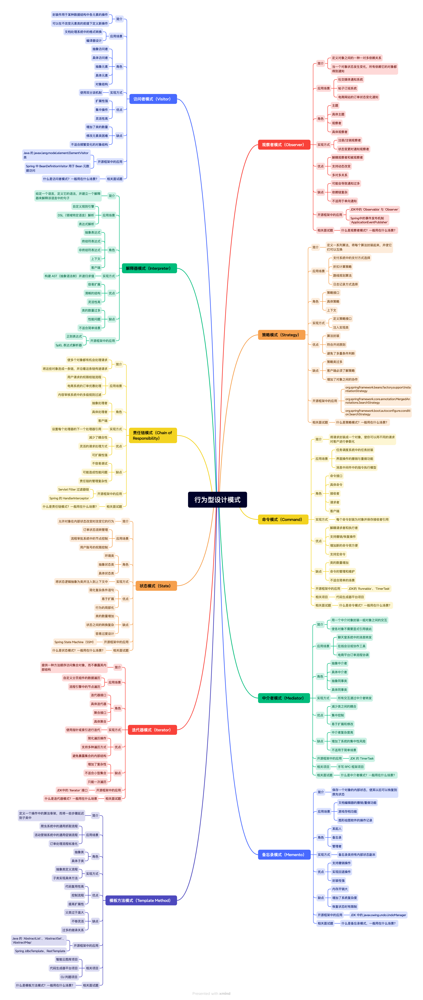

## 介绍
行为型模式，主要是用来解决**对象之间如何协作、职责如何划分、行为如何解耦**的问题。

如果我们把一个系统比作一个团队，那么每个类或对象就像是团队里的不同成员。每个成员不仅要做好自己的本职工作，还要跟其他成员配合得当，才能把整个项目顺利完成。行为型模式就是在告诉我们，这种协作关系应该怎么设计，才能既高效又灵活。

在程序开发中，光有数据结构和功能模块还不够，还需要设计**对象之间怎么交流、怎么协作、职责如何划分**。如果这些关系处理不好，系统会变得非常混乱，修改一个功能可能牵一发动全身。

而通过行为型模式，我们可以把对象之间的职责划分清楚，通信路径明确，既能降低耦合，又方便后期扩展和维护。

我们按照实用性从高到低的顺序，可以有下面这些行为型设计模式:
+ [策略模式](14-策略模式.md)
+ [观察者模式](13-观察者模式.md)
+ [模板方法模式](18-模板方法模式.md)
+ [责任链模式](21-责任链模式.md)
+ [状态模式](20-状态模式.md)
+ [命令模式](15-命令模式.md)
+ [中介者模式](16-中介者模式.md)
+ [迭代器模式](19-迭代器模式.md)
+ [备忘录模式](17-备忘录模式.md)
+ [访问者模式](23-访问者模式.md)
+ [解释器模式](22-解释器模式.md)

## 思维导图

